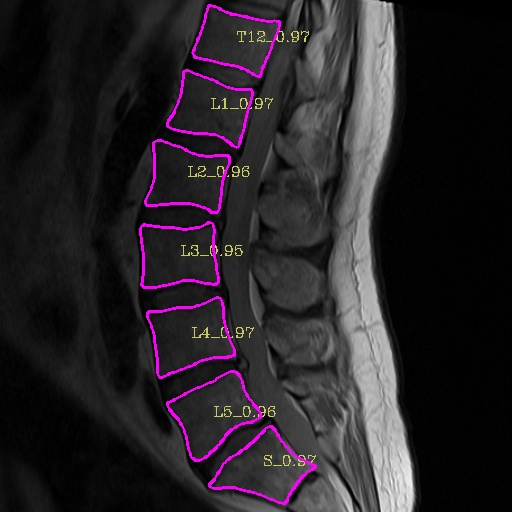
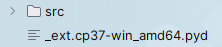

# DL实验课大作业说明
> 本项目基于
> [Deep Snake for Real-Time Instance Segmentation](https://arxiv.org/pdf/2001.01629.pdf)（CVPR 2020 oral），我们对其进行优化并引入医学图像分割领域。
> 此文档旨在帮助大家快速实现代码。

<div style="display: flex; justify-content: space-between;">
  
  
</div>


## 安装
> 预祝各位一切顺利！
### 设置python环境

安装Python （推荐3.7）
```
conda create -n snake python=3.7
conda activate snake
```
### 安装pytorch
1. make sure that the pytorch cuda is consistent with the system cuda！
2. 由于本项目中需要使用完整版 CUDA Toolkit 对 C++ 语言进行本地编译，需格外注意 pytorch 和 CUDA 版本。
3. 推荐使用 pytorch 1.9.0 和 CUDA 11.1 （成功复现）。
4. 如电脑中没有完整版 CUDA Toolkit，请到英伟达官网进行下载。

官网下载：
```
pip install torch==1.9.0+cu111 torchvision==0.10.0+cu111 torchaudio==0.9.0 -f https://download.pytorch.org/whl/torch_stable.html
```
清华源下载：
```
pip --trusted-host pypi.tuna.tsinghua.edu.cn install torch==1.9.0+cu111 torchvision==0.10.0+cu111 torchaudio==0.9.0 -f https://download.pytorch.org/whl/torch_stable.html
```
### 安装Cython
```
 # 如果装不上可以装稍微高一点的版本，反正我没装上
pip install Cython==0.28.2 
```

### 安装其他依赖
```
pip install -r requirements.txt
```

### 安装 apex
```
cd
git clone https:\\github.com\\NVIDIA\\apex.git
cd apex
git checkout 39e153a3159724432257a8fc118807b359f4d1c8
$env:CUDA_HOME="C:\Program Files\NVIDIA GPU Computing Toolkit\CUDA\v11.1"        # 这里修改为你自己的 CUDA Toolkit 路径
python setup.py install --cuda_ext --cpp_ext
# 如果 git 不下来可以手动下载到当前目录并进行编译
```

### 编译 `lib/csrc`下的cuda扩展
本项目经过修改仅需要编译一个 cuda 扩展文件：extreme_utils
```
$env:ROOT="C:\path\to\snake"
cd $env:ROOT\lib\csrc
$env:CUDA_HOME="C:\Program Files\NVIDIA GPU Computing Toolkit\CUDA\v11.1"
cd ..\extreme_utils
python setup.py build_ext --inplace
# 注意将路径改为你的实际路径
```
当编译成功后，文件目录下将会产生一个 _ext 文件。



> 恭喜你已完成安装全部步骤！

## 训练
### 导入数据路径

本项目已将所有数据路径集中在配置文件 sbd_snake.yaml 和 config.py 中，请将路径修改为你的实际路径，设定训练参数，即可开始模型训练。
### 启动训练

```
python train_net.py --cfg_file configs/sbd_snake.yaml model sbd_snake
```

## 测试
### 导入数据路径
本项目已将所有数据路径集中在配置文件 sbd_snake.yaml 和 config.py 中，请将路径修改为你的实际路径，即可进行模型测试。
### 启动测试
```
python test.py
```

## Demo
### 导入数据路径
本项目已将所有数据路径集中在配置文件 sbd_snake.yaml 和 config.py 中，请将路径修改为你的实际路径，即可运行可视化demo。
### 启动demo
```
python demo.py
```
<p style="background-color:DodgerBlue;">&#x2003;ZRC 2024.04.22</p>

